  

<h3 align="center">Final-year ECE Student • Aspiring Software Engineer • Fullstack Dev</h3>

---

### 👨‍💻 About Me
- 👨‍💻 Aka **RGTdevs** in tech.

- 🚀 I love building real-world projects that solve real problems.
- 💡 Currently working on fullstack apps, innovative solutions, and creative interfaces.
- 📚 Problem Solving in DS and Algos.
- 🧠 Self-driven, focused, and always learning something new in tech.

---

### 🛠️ My Tech Stack

---

### 🌟 Highlight Projects

- 📑 [QueryWise](https://github.com/RatneshTripathi07/QueryWise) — AI Powered Document Query System.
- 🚦 [Smart City Platform (SIH 2024)](https://github.com/Ratneshtripathi07/DPMP-SIH24-Project) — For inter-departmental city coordination.
- 💬 [VartaLaap](https://github.com/Ratneshtripathi07/Vartalaap) — Real time chat app project.

---

### 🌐 Connect with Me

---

### 📈 GitHub Stats

  
  

  

---

<!-- Bottom Animated Waves -->

  

